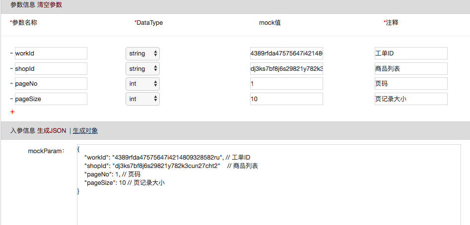

# HopHelper
HOP助手-Chrome扩展

## 通过json反生成参数表单
```json5
// 简单 json 的填充
{
    "workId": "4389rfda47575647i4214809328582ru", // 工单ID
    "shopId": "dj3ks7bf8j6s29821y782k3cun27cht2"    // 商品列表
    "pageNo": 1, // 页码
    "pageSize": 10 // 页记录大小
}
```



```json5
// 复杂json的填充

{
    "taskUserId": "4fd3k1k837h4fk2cwtwnvg1297491nr211jz",    // 操作人
    // 业务店铺信息
    "shop": {
        // 店铺名称
        "shopName": "nanaki旗舰店" // 店铺名称
        // 店铺所属权
        "shopOwner": {
            "permissions": [1,2,3],  // 权限位
            "ownerName": "薛明" // 所属人命名
        }
    },
    // 主人信息
    "seller": {
        "lineNodes": "0-2-3" // 路线节点
    }
}
```


## changelog
+ 2018-05-03 v0.1
    - 创建你hop小助手
+ 2018-05-04 v0.2
    - fix: 修复 测试数据没有命名空间导致，所有 mockParam 内容一致导致的错误 - 阿凯反馈
+ 2018-05-07 v0.3
    - fix: test.do (测试页面) 页面只针对 password 和 userName 命名空间缓存
    - new: add-update.do (新增页面) 添加了入参的 json => param 的支持，目前不支持复杂对象类型的自动填充 - 木鸢的需求
    - new: 支持复杂对象的备注填充满足[json5][http://hjson.org/]规范
    - new: 添加新增接口的部分记忆功能